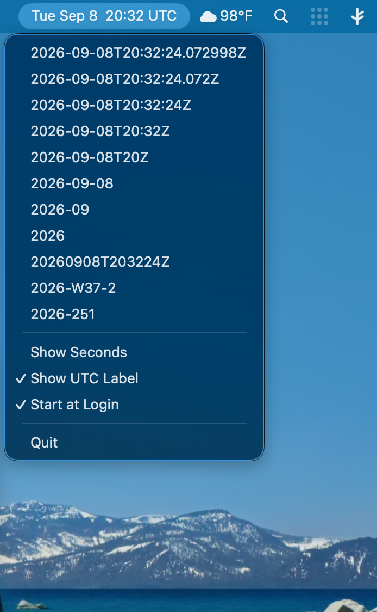

# utc-status

[](https://github.com/lispnik/utc-status-app/actions/workflows/ci-macos.yml)

A macOS menu-bar clock showing UTC, written in Common Lisp.



The title is the current time in UTC, laid out the way your system clock is laid
out. Clicking it opens a menu of ISO 8601 renderings at descending resolution;
choosing one copies that rendering of the current instant to the clipboard.

```
Sun Sep 6  02:05          <- ours, UTC
Sat Sep 5  21:05          <- the system clock, local
```

Same shape, different offset. The screenshot above has **Show UTC Label** turned
on, which appends the ` UTC` — off by default, because the brief was the system
clock's layout and a suffix is not that layout.

Built on [objc](https://github.com/lispnik/objc), the LispWorks Objective-C
interface reimplemented for SBCL. The status item, its menu, the timer and the
pasteboard are all Objective-C objects driven from Lisp, and the menu's actions
are Lisp methods on a Lisp-defined class.

## Download

[**Releases**](https://github.com/lispnik/utc-status-app/releases) carries a
signed, notarised disk image. Open it, drag *UTC Status* to Applications, done —
the image and the application are both notarised, so it opens with no warning.

## Building and running

```
make            # build bin/utc-status
make test       # the FiveAM suite
make run        # build and run
```

The objc bindings are a sibling checkout rather than an ocicl package, so clone
both and the defaults line up:

```
git clone https://github.com/lispnik/objc.git
git clone https://github.com/lispnik/asdf-macos-app.git   # only for `make app'
git clone https://github.com/lispnik/utc-status-app.git
cd objc && ocicl install     # every dependency of BOTH projects is listed here
cd ../utc-status-app && make
```

The Makefile builds a source registry from this tree plus that one, with
`:ignore-inherited-configuration` so a missing dependency fails loudly rather
than resolving to whatever is in your `~/.sbclrc`. `OBJC_DIR` overrides where it
looks and defaults to `~/Projects/common-lisp/objc`; `MACOS_APP_DIR` does the
same for asdf-macos-app, which only `make app` needs.

`ocicl install` belongs in the **objc** checkout: this project has no `ocicl.csv`
of its own, and every Lisp dependency it has — cffi, alexandria, closer-mop,
bordeaux-threads, trivial-features, float-features, fiveam — comes from objc's.

`make env` prints what the layout code decided on your machine, which is the
first thing to look at if the menu-bar text is not the shape you expected:

```
$ make env
machine:     ARM64
lisp:        SBCL 2.6.8
preferences: (:DAY-OF-WEEK T :DATE T :SECONDS NIL)
skeleton:    "EEEMMMdjmm"
title:       "Sun Sep 6  07:15"
```

```
./bin/utc-status                  # the menu-bar clock
./bin/utc-status --label " UTC"   # append a label to the title
./bin/utc-status --list           # every rendering of right now
./bin/utc-status --print seconds  # one rendering, for a script
./bin/utc-status --timeout 30     # stop after 30 seconds, whatever happens
```

`--list` and `--print` need no window server, so the renderings are usable from
a shell:

```
$ ./bin/utc-status --print basic
20260906T020523Z
```

## The .app bundle

```
make app             # build "build/UTC Status.app"
make install-app     # copy it to ~/Applications
```

Built by [asdf-macos-app](https://github.com/lispnik/asdf-macos-app), which is a
third sibling checkout (`MACOS_APP_DIR`, defaulting to
`~/Projects/common-lisp/asdf-macos-app`). The bundle exists for one key:

```
"LSUIElement" => true
```

That is what tells the Dock and the application switcher to leave it alone, and
it lives in an `Info.plist`, which a bare executable does not have. `run` sets
the activation policy to Accessory at startup anyway — that is what makes the
loose binary work at all — but doing it in code means the Dock icon exists for
the instant before the policy is set. Declared beats done.

The bare binary is kept rather than replaced: `utc-status --print seconds` is
what it is for, and a `.app` is an awkward thing to put in a shell pipeline —
literally so, because the bundle redirects its own stdio (see below).

**The icon is drawn, not checked in.** `make icon` runs `tools/icon.lisp`, which
uses the same objc bindings the application is built on to draw a "TZ" monogram
into an `NSBitmapImageRep` and write it out as a PNG; asdf-macos-app converts
that to an `.icns` with `sips` and `iconutil` at build time. There is no binary
artwork in the repository and changing the colour is an edit:

```lisp
(objc:invoke (color 0.10 0.13 0.22) "set")            ; the plate
(draw-clock size :colour (color 0.42 0.46 0.56))      ; ring, marks, two hands
(draw-monogram "TZ" size :font-fraction 0.32
                         :colour (color 0.98 0.85 0.45))
```

The clock reads ten past ten, which is what every clock in every advertisement
shows and for the same reason: the hands sit high and apart, framing what is in
the middle rather than striking through it. No second hand — a third hand at
this size is a smudge, and this clock is not running.

Three things had to be got right, and each produces a plausible wrong answer
rather than an error. **Clock angles run clockwise from twelve while Cocoa's y
axis runs up**, so the usual `(cos, sin)` pairing is wrong twice over — and
wrong in a way that still draws a perfectly convincing clock, showing the wrong
time, mirrored. `x` takes the sine and `y` the cosine. **A Lisp string is a CLASS NAME
when it is the receiver** — `(objc:invoke "TZ" "sizeWithAttributes:" …)` asks
for a class called `TZ` — so the text is converted with `string-to-ns-string`
first. And **`-drawAtPoint:` positions the line box, not the ink**: a line box
reserves room for descenders, which "TZ" has none of, so centring on the
measured height hangs the letters visibly low. It centres on cap height above
the baseline instead.

And a composition note that only showed up on screen: at the monogram's original
size the letters swallowed both hands entirely, leaving a ring with tick marks —
which is not a clock. The face is larger and the letters smaller than they first
were, so the hand tips clear the letterforms.

Worth knowing where the icon is actually seen: `LSUIElement` means no Dock icon
and no application-switcher entry, so it appears in Finder, Spotlight and "Open
With", and nowhere else while the app runs.

**`Contents/Frameworks/` is empty, and that is correct.** asdf-macos-app copies
the dylibs CFFI reports so a bundle is self-contained; objc binds
`/usr/lib/libobjc.A.dylib` and the system frameworks, which are the OS's and
must not be copied in. An empty Frameworks directory here is the right answer,
not a missed step.

**The bundle is signed** with a Developer ID and the hardened runtime:

```
$ codesign -dvv "build/UTC Status.app"
CodeDirectory v=20500 flags=0x10000(runtime)
Authority=Developer ID Application: Matthew Kennedy (Q47YS469F2)
TeamIdentifier=Q47YS469F2
$ codesign --verify --deep --strict "build/UTC Status.app"   # exit 0
```

The identity comes from the environment and defaults to **ad hoc**, so a clone
builds anywhere:

```
make app                                                    # ad hoc
make app SIGN_IDENTITY="Developer ID Application: You (TEAMID)"
```

Hardcoding a Developer ID in the `.asd` broke CI the moment it was tried --
`codesign` answers "no identity found" for a certificate that is not in the
keychain, and no build should require one. Ad hoc runs locally and cannot be
notarised, which is the right default; notarising is the deliberate act that
supplies the identity.

**It needs an SBCL built `--without-sb-core-compression`.** SBCL enables core
compression whenever it finds zstd, and the runtime then links
`/opt/homebrew/opt/zstd/lib/libzstd.1.dylib` **by absolute path** — so the
bundle launches on the machine that built it and dies with a dyld error
anywhere else. Notarisation does not catch this: Apple checks the signature, not
whether your dylibs exist on someone else's disk.

```
$ otool -L "build/UTC Status.app/Contents/MacOS/utc-status"
  /usr/lib/libSystem.B.dylib          # and nothing else
```

The compression was pure cost here, incidentally: the bundle never set
`:compression`, so the core was never compressed in the first place. Dropping
zstd changed the bundle size by nothing and removed the only external
dependency.

That did not work at first, and the reason is worth knowing if you build SBCL
apps. `save-lisp-and-die :executable t` appends the core to the runtime's Mach-O
*past* the code signature — `__LINKEDIT` and the signature both end at byte
410,952 of a 47,782,952-byte image — and codesign refuses 47MB of trailing data
it cannot cover, with `main executable failed strict validation`, for a Developer
ID as much as for ad hoc.

[asdf-macos-app](https://github.com/lispnik/asdf-macos-app) now ships the core as
a sealed **resource** with the SBCL runtime as the executable and a symlink
between them, which signs cleanly. Ad hoc is still only enough to launch
locally; put a Developer ID in `utc-status-app-bundle.asd` to notarise, and
nothing else changes.

**The bundle prints SBCL's banner.** A separate core does, unless `--noinform`
is passed, and LaunchServices passes nothing. It comes from the C runtime before
Lisp starts, so nothing in Lisp can suppress it. It goes to the log.

**The bundled executable does not print to your terminal.** asdf-macos-app's
toplevel redirects stdio to `~/Library/Logs/UTC Status.log`, because a
Finder-launched process has nowhere else to write. So this looks like it does
nothing:

```
$ "build/UTC Status.app/Contents/MacOS/utc-status" --print seconds
$ tail -1 ~/Library/Logs/"UTC Status.log"
2026-09-07T17:19:10Z
```

`MACOS_APP_LOG` sends that somewhere else. Use `bin/utc-status` for the command
line; the bundle is the GUI.

That redirection found a real bug in this application, which is why CI asserts on
it: `main` called `sb-ext:exit` without flushing, and against a buffered log
stream the output went nowhere at all — not to the terminal, not to the log.

### Packaging

```
make dmg SIGN_IDENTITY="Developer ID Application: You (TEAMID)"
make notarize-dmg
```

**The disk image is notarised and stapled in its own right**, not just the
application inside it. Stapling only the app leaves the *download* unrecognised,
so the first thing a user touches is the thing Gatekeeper complains about.
Notarising the app first is still required — the notary service inspects what is
inside the image.

### Notarising

```
xcrun notarytool store-credentials utc-status \
  --apple-id you@example.com --team-id Q47YS469F2      # once
make notarize
```

Submits the signed bundle, waits for Apple's verdict, and staples the ticket
into it. Stapled means it validates with no network round-trip, so the app opens
on a Mac that is offline.

```
build/UTC Status.app: accepted
source=Notarized Developer ID
```

**This is not the App Store.** Notarisation is an automated malware scan that
lets an app *you* distribute — a download, a disk image — open without the
"unidentified developer" refusal. Nothing is published, listed or reviewed. The
App Store is a different channel with a different certificate, human review, and
the App Sandbox — which this application could not adopt as it stands, since
`allow-jit` and `allow-unsigned-executable-memory` are exactly what an SBCL
image needs and exactly what the store refuses.

`make notarize` guards two failures that are slow and silent respectively:

- an **ad hoc** signature, which Apple refuses only after the upload;
- an executable linking anything outside `/usr/lib` and `/System`, which
  notarises perfectly well and then dies with a dyld error on a Mac that has no
  Homebrew.

Both guards were checked by feeding them the failure: an ad-hoc-signed copy of
the bundle, and a Homebrew SBCL runtime that still links `libzstd`.

**The ticket belongs to the bits, not the project.** `build/` is gitignored and
`make clean` removes it, and a rebuild is unnotarised until it is submitted
again. `make install-app` copies the notarised bundle to `~/Applications` before
that can happen.

## Starting it at login

The menu has a **Start at Login** item, which is the one to use: it appears in
System Settings → General → Login Items, where the user can see it and switch it
off, and it needs no Makefile target and no file written behind their back. It
is offered only from the `.app` bundle — there is no `.app` for the login item
list to point at otherwise.

**There is no `Info.plist` key for this.** It is the first thing people look for,
and there is no `LSStartAtLogin`: a login item is not declared, it is
*registered* at run time by the application itself.

**It uses `LSSharedFileList`, not `SMAppService`, and that is a considered
choice.** `SMAppService` is what Apple documents for macOS 13 and later, and
`-[SMAppService mainAppService]` answered `NotFound` here in every arrangement
tried: from the loose binary, from the bundle in place, from `~/Applications`
and from `/Applications`, launched directly and through LaunchServices,
unsigned, Developer ID signed, and notarised and stapled. LaunchServices knew
the application throughout — `lsregister -dump` lists it — and the system log
recorded the call reaching `com.apple.libxpc.SMAppService` and answering
`status: 3`, with no reason given.

So this does what shipping applications do. **Hammerspoon and Syncthing both use
`LSSharedFileList` and neither links ServiceManagement at all** — Syncthing's own
selectors are `addAppAsLoginItem`, `deleteAppFromLoginItem` and
`wasAppAddedAsLoginItem`. The API has been deprecated since 10.11 and it is what
works.

These are C functions rather than messages, so CFFI makes the five calls that
have no Objective-C face — and toll-free bridging does the rest: a `CFURLRef` is
an `NSURL` and a `CFArrayRef` is an `NSArray`, so the URL is built and the
snapshot walked with ordinary `invoke`.

The LaunchAgent is still here for the bare binary, which cannot be a login item:

```
make install-agent       # start the bare binary at login
make install-app-agent   # start the .app bundle at login instead
make agent-status        # what launchd thinks of it
make uninstall-agent     # stop it and remove the agent
```

Either works; the bundle is the better of the two, because it gets `LSUIElement`
from its `Info.plist` rather than only from the activation policy set at startup.
Both use the same plist template, with `EXEC` deciding what launchd starts.

A **LaunchAgent**, not a LaunchDaemon: an agent runs in your GUI session, which
is the only place a status item can exist. A daemon runs before login, in no
session, with no menu bar to put anything in.

Three details in `etc/com.lispnik.utc-status.plist.in` are deliberate:

**`KeepAlive` is `{SuccessfulExit: false}`, not `true`.** A bare `true` is the
obvious thing and is a trap: choosing Quit from the menu exits 0, and launchd
would put the item straight back in the menu bar. A Quit that does not quit is
worse than no Quit at all. This restarts it only while it keeps *failing*.

**The agent points at `$(PREFIX)/bin`, not at `./bin`.** `make install-agent`
copies the binary to `~/.local/bin` first, so that `make clean` — or moving this
checkout — does not leave launchd trying to start something that is no longer
there.

**Every path in it is absolute.** A plist cannot expand `~` or `$HOME`, and one
with a relative path fails by never starting. That is why the file is a template
with `@BINARY@` and `@LOGS@` filled in at install time rather than a plist you
copy.

`install-agent` boots the label out before bootstrapping it, and ignores the
failure: bootstrapping a label that is already loaded is an error, so without
that the second `make install-agent` would fail.

Output goes to `~/Library/Logs/utc-status.log`. It is normally empty — if the
clock is not in your menu bar, that file and `make agent-status` are the two
places to look, along with [the note about a crowded menu
bar](#known-it-may-not-appear-on-a-crowded-menu-bar).

## The renderings

| Key | Example | For |
|---|---|---|
| `microseconds` | `2026-09-06T02:05:23.043479Z` | full precision, as the clock has it |
| `milliseconds` | `2026-09-06T02:05:23.043Z` | what most log formats use |
| `seconds` | `2026-09-06T02:05:23Z` | the everyday ISO 8601 timestamp |
| `minutes` | `2026-09-06T02:05Z` | reduced accuracy |
| `hours` | `2026-09-06T02Z` | reduced accuracy |
| `date` | `2026-09-06` | the calendar date alone |
| `month` | `2026-09` | |
| `year` | `2026` | |
| `basic` | `20260906T020523Z` | no separators — sorts, and is safe in a filename |
| `week` | `2026-W36-7` | ISO week date |
| `ordinal` | `2026-249` | ISO ordinal date |

The menu shows each of these as a live example, retitled just before it opens, so
the line you click is the string you get.

Below them are two checkable items:

| Item | Effect |
|---|---|
| **Show Seconds** | seconds in the menu-bar title, regardless of what the system clock does |
| **Show UTC Label** | append ` UTC`, so two identically-shaped clocks are told apart |

Both are stored in `com.lispnik.utc-status` and survive a restart. **Absent means
"follow the system"** — the state before you have touched either — and once set,
ours wins. That is what makes them behave like checkboxes: the first click writes
the opposite of whatever is on screen, whichever way the system had it. An
explicit *off* is not the same as never having chosen, which matters on a Mac
whose own clock shows seconds and you want this one not to.

## What "the same layout as the system clock" means here

Not a format string copied from one Mac. The system clock's shape is a set of
preferences — day of week, date, seconds, and the 12/24-hour choice — so this
reads `com.apple.menuextra.clock` and builds the same shape from them.

**A setting changed while it is running takes effect within ten seconds**, with
no restart. The clock re-reads the preferences every twentieth tick and rebuilds
its formatter only when they actually differ.

Polling, and that is a considered second choice rather than laziness.
`NSUserDefaultsDidChangeNotification` is the obvious tool and is the wrong one:
it is posted for changes made in *this* process, and the change worth reacting
to — someone turning on 24-Hour Time in System Settings — happens in another.
Comparing two small plists on a timer is unglamorous and actually works:

```lisp
(setf (preference +seconds-key+) :off)
(menu-bar-title instant)          ; => "Sat Sep 5  21:47"
;; ... `defaults write com.lispnik.utc-status ShowSeconds -bool true'
;;     from another process, exactly as System Settings would ...
(menu-bar-title instant)          ; => "Sat Sep 5  21:47:03"
```

Two details make that work outside one machine:

**The field order is the locale's.** Rather than concatenating "EEE" and "MMM d"
in the order an English speaker expects, the preferences become a Unicode
date-field *skeleton* — an unordered set of the fields wanted — and
`+dateFormatFromTemplate:options:locale:` turns that into the pattern the locale
actually uses. `en_US` gives `EEE MMM d`, `en_GB` gives `EEE d MMM`, and neither
is written down anywhere here.

**The hour field is `j`, not `H` or `h`.** `H` forces 24-hour and `h` forces 12;
`j` means "whichever this locale uses", which is what follows the 24-Hour Time
switch in Settings. Asking for `H` gives a 12-hour user 24-hour time silently and
forever.

One thing has to be undone afterwards: `dateFormatFromTemplate:` writes a pattern
for *prose*, joining the date and time with a word — `EEE, MMM d 'at' HH:mm` —
and the menu bar does no such thing. So the quoted literals and the commas are
stripped. Removing every *quoted* literal rather than the English word "at" is
what keeps it working in German (`'um'`) and French (`'à'`).

## Known: it may not appear on a crowded menu bar

The item can be created, report itself visible, be given a real frame — and still
not be on screen, because macOS has run out of menu bar. This happened while the
app was being written: with a long application menu (IntelliJ's runs to about
850px on a 1470pt screen) and a full status area, the item was placed at x=424,
underneath the active application's menu titles, where nothing draws it.

Nothing warns you. If the clock does not appear, make room: quit some menu-bar
items, or use something like Ice or Bartender, or check with a frontmost
application whose menu is shorter.

## Design

Three systems in one `.asd`:

| System | Contents |
|---|---|
| `utc-status-app` | the library |
| `utc-status-app/app` | `program-op` → `bin/utc-status`, entry point `utc-status-app:main` |
| `utc-status-app/tests` | the FiveAM suite |

`src/iso.lisp` has no Objective-C in it. Everything there is a pure function of
an instant, which is what lets the suite check the formatting on any machine in
any timezone — and it is why the renderings are a table rather than a `case`
inside the menu handler: the menu, the command line and the tests all walk the
same list, and three places that each know the renderings is three places to
forget one.

`:build-pathname` is resolved against the *system's* pathname, so the components
live in a `:module` rather than under a system-level `:pathname` — otherwise the
binary lands in `src/bin/utc-status`.

### Four things about the AppKit side that are not obvious

Three of them fail silently.

**The application must be an accessory.** `NSApplicationActivationPolicyRegular`
is the default and is right for something that owns windows. A Regular
application with no windows that has never been activated does not get its
status item's menu tracked — the item draws, and clicking it does nothing.

**It must use `-[NSApplication run]`, not a pump loop.** A status item's menu is
tracked in AppKit's own nested run-loop mode while the mouse is down. A loop
that pumps `kCFRunLoopDefaultMode` by hand — the right way to keep a *window*
alive from a REPL — starves that tracking, and the symptom is identical to the
wrong activation policy.

**The timer must be added in `NSRunLoopCommonModes`.** A timer scheduled the
ordinary way runs in the default mode only, so it stops while a menu is open —
and this menu shows timestamps, so the one moment the clock must not freeze is
exactly the moment it would. `+scheduledTimerWithTimeInterval:` does the ordinary
thing, which is why the timer is created unscheduled and added by hand.

**`-stop:` alone does not end `-run`.** It sets a flag the loop notices only when
it next finishes processing an event, so an idle loop sits there. A dummy event
posted behind the stop guarantees there is an event to finish.

`--timeout` is a fifth timer rather than a watchdog thread, and that was not the
first design. The thread version *looked* correct and did not work: it woke on
schedule, saw the application still running, and sent
`-performSelectorOnMainThread:` without raising — and the application carried on,
with nothing anywhere to say why. A one-shot timer needs no cross-thread
messaging, no reasoning about which thread may call `-stop:`, and is stopped by
the same `-invalidate` as the clock.

### And two about the rest

**AppKit has to be asked for.** `ensure-objc-initialized` loads Foundation and
nothing else, which is the right default for a binding — but everything visible
here is AppKit, and the symptom of forgetting is `Cannot find class "NSMenu"`,
which reads like a fault in the bindings and is a missing framework. It is worth
the file it gets (`src/frameworks.lisp`) because of how it was found: the menu
tests were passing only when the clipboard test happened to run first and load
AppKit on their behalf, so the suite was green in one order and skipped in
another. Every entry point that touches an AppKit class now calls
`ensure-appkit` rather than trusting that something else already did.

**`-clearContents` is not tidiness.** A pasteboard holds one item per type, and
the owner of each type is whoever wrote it last. Writing a string without
clearing leaves every other representation of the *previous* contents in place,
so an application that prefers a richer type pastes the old value while a plain
text editor pastes the new one — copy works everywhere except the one
application the user cares about.

## Tests

109 checks — 107 without the clipboard ones. The formatting half is checked against instants worked out
independently rather than by running the code and recording what it said, which
is the failure a formatting suite is most prone to: a test that agrees with the
bug. Beyond the obvious coverage:

- fractional seconds **truncate rather than round**, because a timestamp that
  rounds up names an instant that has not happened yet;
- the ISO week year is not the calendar year — 2027-01-01 is `2026-W53-5`;
- the skeleton uses `j` and never `H` or `h`;
- the menu-bar title is UTC and not local;
- and choosing a menu item is tested by sending `-copyRendering:` with a real
  menu item as the sender, which exercises the tag lookup and the pasteboard
  write, leaving only the mouse untested.

There is deliberately no "skip if Objective-C is unavailable" wrapper. An
earlier version had one, and it turned the missing-AppKit bug above into two
quiet skips rather than two failures. This is macOS-only software; a class that
will not resolve is a failure, and should read as one.

The clipboard tests are gated behind `UTC_STATUS_TEST_CLIPBOARD`, and `make test`
leaves them out. The general pasteboard belongs to whoever is at the keyboard,
and a suite that overwrites it has thrown away whatever they had copied. `make
test-clipboard` opts in.

## License

MIT.
